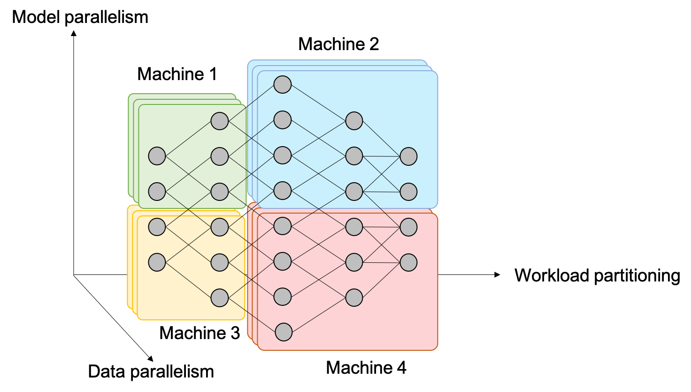

# Megatron MolBART

This is a version of MolBART that uses NVIDIA's Megatron framework for model parallelism along with support for Multi-GPU and Multi-Node data parallelism using DeepSpeed. Link to ChEMBL 27 dataset in CSV format: https://drive.google.com/file/d/17DKzuXmfmMP0XUInZrEdJ10sBxkehmzR/view?usp=sharing

## Installation

Follow these steps in order:

`conda create -c rdkit -n molbart rdkit` <br>
`conda activate molbart` <br>
`pip install -r ../requirements.txt` (MolBART repo) <br>
`pip install -e ..` (MolBART repo) <br>
`pip install pybind11==2.6.2` <br>
`pip install six==1.15.0` <br>
`pip install regex` <br>
`pip install deepspeed==0.3.10` <br>
`cd apex; pip install -v --disable-pip-version-check --no-cache-dir --global-option="--cpp_ext" --global-option="--cuda_ext" ./` (Download NVIDIA apex source) <br>
`cd pysmilesutils; python setup.py install` (Download pysmilesutils source) <br>
`cd Megatron-LM-v1.1.5-3D_parallelism; python setup.py install` <br>

After all of these steps, if you still get an import error when running train_megatron.sh involving amp_C, this will fix the issue:

`pip uninstall apex; cd apex; pip install -v --disable-pip-version-check --no-cache-dir --global-option="--cpp_ext" --global-option="--cuda_ext" ./` <br>

## Code

### megatron_bart.py

This file contains the source code for the Megatron implementation of the BART architecture. The high-level API of the MegatronBART model exactly resembles BARTModel. Concretely, the overall API is kept the same but the encoder and decoder is swapped out with parallelized versions.

### csv_data.py

This file contains a simple data loader for csv files that have SMILES strings on each row.

### train.py

This file contains the training code that sets up Megatron and DeepSpeed and runs the training loop. Currently, the code loads in a subset of ChEMBL in CSV format and runs training (line 320). Replace this file with your own data.

### ds_config.json

This file contains the parameters for DeepSpeed (important). Notably, all of the parameters in this file should probably be kept the same except ```train_batch_size``` and ```train_micro_batch_size_per_gpu```. These parameters can be modified to improve training speed; generally, the larger batch sizes lead to much faster training. During training, DeepSpeed prints out the number of samples being processed per second (```SamplesPerSec```), which can be used a proxy for determining how fast training is.

### Kicking off Training

The `train_megatron.sh` bash script in the top level of the repository can be run to kick off training. Important parameters in this script include:

```GPUS_PER_NODE```: Number of GPUs to use per node <br>
```NNODES```: Number of nodes to run DeepSpeed with <br>
```MASTER_ADDR```: Distributed training address (must be changed for SLURM/Multi-Node setting) <br>
```MASTER_PORT```: Distributed training port (must be changed for SLURM/Multi-Node setting) <br>
```NODE_RANK```: Must be changed for SLURM/Multi-Node setting <br>
```mp_size```: Model parallelism size <br>
```--num-layers```: Number of hidden layers in Encoder and Decoder <br>
```--hidden-size```: Hidden dimension in Encoder and Decoder <br>
```--num-attention-heads```: Number of attention heads in Encoder and Decoder <br>
```train-iters```: How many training iterations <br>
```save```: Output model checkpoint directory name <br>

The default `train_megatron.sh` script in this repository runs the original 12 million parameter MolBART model on 4 GPUs and a single node on the ChEMBL dataset.

### Model and Data Parallelism Gotchas

- Number of GPUs need to be a multiple of the MP size
- World size = No. of GPUS * No. Nodes / MP size
- DeepSpeed requires that the train batch size = world size * mini batch size * gradient accumulation steps
- The parameter MP_size indicates number of GPUs model is split across for model parallelism
  - Example: 12 GPUs with MP size = 4; data parallelism size will be 3 and there will be one copy of the model for each 4 GPUs  

<!-- .element height="50%" width="50%" -->


